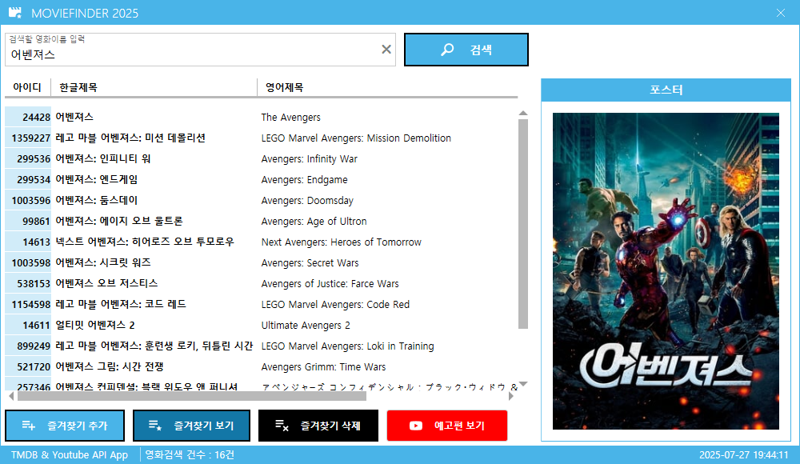
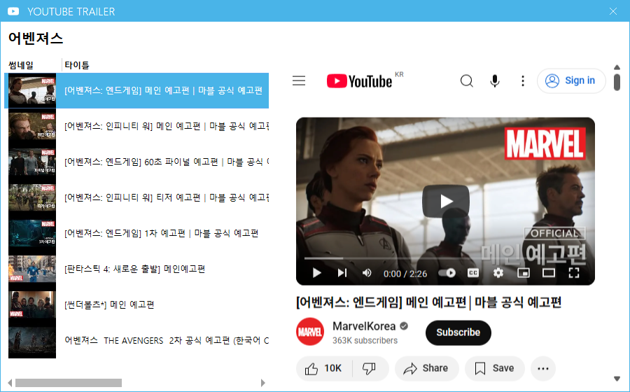
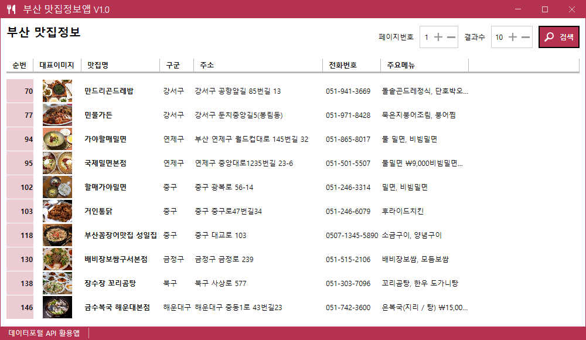
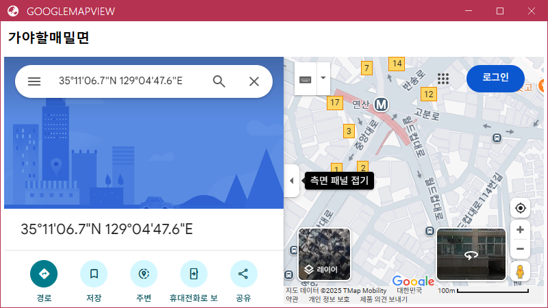

# Toy_Projects
## 토이프로젝트 모음 리포지토리

***

## 📝 1. 개인 포트폴리오 사이트 게시판 - [소스](https://github.com/phm0423/iot-webapp-2025/tree/main/day10/Day10Study)

#### 기술 스택
- MySQL
- C# ASP.NET

#### 설명
- 포트폴리오 웹 사이트 내 게시판 페이지
- 해당 페이지에서 게시글 **조회/추가/수정/삭제** 가능

---

## 🔍 2. Movie Finder (영화 검색 애플리케이션)

### 📌 프로젝트 설명
- **WPF 기반 영화 검색 앱**
- 사용자가 입력한 영화 제목으로 **Open API** 검색
- 예고편은 **YouTube API**를 통해 영상으로 제공
- MVVM 아키텍처 기반으로 구조화

### 🖼️ 주요 기능
- 영화 제목으로 검색
- 포스터, 줄거리, 감독, 출연진 정보 표시
- 예고편 영상 재생 기능

### 🛠️ 기술 스택
- WPF (.NET)
- MVVM 구조
- Naver 영화 API
- YouTube API
- NLog (로깅)

### 🎬 예시 화면
| 검색 결과 | 예고편 보기 |
|-----------|-------------|
|  |  |

### 🎥 영상

---

## 🍜 3. Busan Restaurant App (부산 맛집 탐색 애플리케이션)

### 📌 프로젝트 설명
- 부산지역의 대표 맛집 정보를 제공하는 **WPF 앱**
- 리스트와 상세 정보를 함께 보여줌
- 지도는 **Google Maps API** 연동

### 🖼️ 주요 기능
- 부산 맛집 리스트 출력
- 맛집 클릭 시 상세 정보 표시
- 지도 위치 확인 기능 (Static Map)

### 🛠️ 기술 스택
- WPF (.NET)
- MVVM 패턴
- JSON 데이터 바인딩
- Google Maps Static API

### 🍽️ 예시 화면
| 맛집 목록 | 지도 연동 |
|-----------|-----------|
|  |  |

---

## 윈앱으로 만든 계산기 

### 📌 주요설계 및 기능
- 텍스트박스안의 연산할 수 사이의 기호를 기준으로 split하여 연산할 두 수를 구분
- 실수와 정수는 계산을 따로 하도록 설계
- 0으로 나누웠을 때 생기는 예외처리
- 마우스로 버튼을 클릭해도 텍스트박스가 활성화 되도록 Focus 사용
- = 버튼을 엔터키로 이용할 수 있게 KeyDown을 적용

